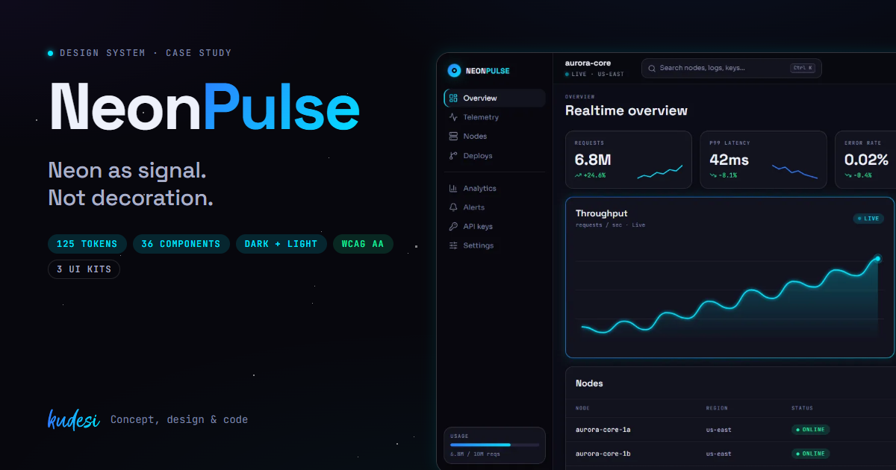

# NeonPulse — Design System

**NeonPulse** is a dark-first design language for cyberpunk-flavoured web and app products. It pairs **flat, near-black surfaces** with **electric neon accents** (blue → cyan → violet, plus a hot-magenta "pulse") and a **geometric, techy type system** (Space Grotesk / Sora / JetBrains Mono). Depth never comes from heavy shadows — it comes from **surface lightness steps** and a **restrained neon halo** on the elements that matter.

**Live docs:** https://kujoh1.github.io/Designsystem-Neonpulse/ · **Case study:** https://kujoh1.github.io/Designsystem-Neonpulse/showcase/ · **Governance:** https://kujoh1.github.io/Designsystem-Neonpulse/governance/

> Built from scratch to a one-line brief ("neon pulse flat design, cyberpunk style") by **kudesi** — concept, visual design, tokens, components, docs and front-end. Not a recreation of an existing brand.



---

## Highlights

- **Two-tier tokens.** Primitives say what a value *is* (`--neon-cyan`), semantic aliases say what it's *for* (`--color-accent`). Components consume aliases only, so a rebrand or theme is a change in one place.
- **Dark + light theme** via one attribute (`data-theme="light"`), nestable on any subtree. Gradients, glows, focus rings and edges are *derived* from the neon hues.
- **Accessible by construction.** Every text token passes WCAG AA (≥ 4.5:1) in both themes, every control has a visible `:focus-visible` ring, switches are real checkboxes, `prefers-reduced-motion` is respected.
- **Complete state model.** Rest · hover · focus · active · loading · disabled · invalid · empty are derived from interaction tokens — never hand-painted per component.
- **36 elements & patterns** — buttons, icon buttons, badges, fields, input groups, switch, tabs, segmented control, tooltip, meter, avatar, kbd, cards, layout primitives, banners, empty/skeleton states, lists, tables, modal, toasts, ⌘K command palette, code block, sidebar nav item.
- **Three interactive UI kits** (marketing, SaaS dashboard, mobile) built from the system's own classes.
- **Living docs.** Swatches, contrast ratios and the full token table are read from the stylesheet at runtime; theme switch, ⌘K search and the source of every specimen are built in.
- **Governance built in.** The [PR Guardian](https://github.com/Kujoh1/neonpulse-pr-guardian) — an n8n workflow with Claude — reviews every pull request against this system's rulebook and comments with exact token fixes. [Explained for decision-makers](https://kujoh1.github.io/Designsystem-Neonpulse/governance/) · [live workflow](https://kujoh1.github.io/Designsystem-Neonpulse/governance/workflow.html) · [live check: one PR fails, one passes](https://kujoh1.github.io/Designsystem-Neonpulse/governance/check.html).
- **Zero build.** Plain HTML/CSS, self-hosted variable fonts (no Google request), CDN dependencies pinned with SRI hashes. Deploys to GitHub Pages on push.

---

## Quick start

```bash
git clone https://github.com/Kujoh1/Designsystem-Neonpulse.git
cd Designsystem-Neonpulse
python3 -m http.server 8000      # or: npx serve .
# open http://localhost:8000
```

Serve over HTTP (not `file://`) — the docs read the stylesheet with `fetch()` and size the specimen iframes from their content.

### Use it in a page

```html
<link rel="stylesheet" href="colors_and_type.css">

<body class="np-scope">
  <div class="np-card np-card--live">
    <span class="np-card__eyebrow">p99 latency · live</span>
    <div class="np-card__metric">42ms</div>
  </div>
  <button class="np-btn np-btn--primary">Deploy</button>
  <label class="np-switch">
    <input type="checkbox" role="switch" checked>
    <span class="np-switch__track" aria-hidden="true"></span>Auto-scale
  </label>
</body>
```

### Theming

```html
<html data-theme="light">                       <!-- whole page -->
<section data-theme="dark"> … </section>        <!-- or an island; nesting works both ways -->
```

```css
/* rebrand inside the palette: swap the hues — everything derived follows */
[data-brand="hot"] { --neon-blue: var(--neon-violet); --neon-cyan: var(--neon-magenta); }
```

---

## Architecture

```
fonts ─► 1 PRIMITIVES ─► 2 SEMANTIC ALIASES ─► 3 ELEMENTS ─► 4 PATTERNS ─► UI KITS
         --bg-2            --color-surface        .np-btn        .np-card       marketing
         --neon-cyan       --color-accent         .np-input      .np-stack      dashboard
         --s-4, --r-lg     --ring-focus, --z-*    .np-switch     .np-modal      mobile
```

Everything lives in **one file**, `colors_and_type.css` — the single source of truth:

| Layer | Selector | Contents |
|---|---|---|
| 0 · Fonts | `@font-face` | Space Grotesk, Sora, JetBrains Mono (variable woff2 in `fonts/`) |
| 1 · Primitives | `:root, [data-theme="dark"]` | colour ramps, type scale, spacing, radii, shadows, motion |
| 2 · Aliases | `:root, [data-theme]` | derived primitives (gradients, glows) + `--color-*`, `--ring-*`, `--z-*`, `--icon-*`, `--state-*` |
| Light theme | `[data-theme="light"]` | light ramp, ink-tuned accents and semantic colours, softer halos |
| 3 · Elements | `.np-btn`, `.np-input`, `.np-badge` … | single controls with the full state model |
| 4 · Patterns | `.np-card`, `.np-stack`, `.np-modal` … | compositions, layout, content and overlay patterns |

Aliases are declared on `:root, [data-theme]` so every themed subtree re-resolves them against its own primitives.

---

## Project structure

| Path | What |
|---|---|
| `index.html` | Docs home — interactive reference (theme switch, ⌘K search, live token table). |
| `showcase/` | Case-study / marketing page (DE/EN) presenting the system. |
| `evals/` | Agent eval (DE/EN): a customer-service agent in two versions against a golden dataset, release gate and in-life-management loop. |
| `governance/` | PR Guardian explained for management (DE/EN) + `workflow.html`, an interactive read-only view of the n8n workflow, + `check.html`, a live check of two pull requests (one fails, one passes). |
| `colors_and_type.css` | **Single source of truth**: tokens, light theme, elements, patterns. |
| `fonts/` | Self-hosted variable fonts + licence notes. |
| `effects/starfield.css` | Starfield scene backdrop (brand effect). |
| `preview/` | Specimen cards embedded in the docs (`<!-- @dsCard group="…" -->` on line 1). |
| `ui_kits/marketing/` | Landing page kit (React via CDN). |
| `ui_kits/dashboard/` | SaaS dashboard kit — charts, modal, toasts, ⌘K palette. |
| `ui_kits/mobile/` | Mobile app kit — iOS frame, tab bar, settings. |
| `assets/` | kudesi wordmark, social preview image. |
| `CLAUDE.md` · `SKILL.md` | Machine-readable rules and conventions for coding agents. |
| `CHANGELOG.md` | Release notes. |

---

## Design principles

1. **Dark is the canvas, neon is the signal.** ~90% of a screen is `--bg-*` and grey text. Neon marks the *one* thing that's interactive or live.
2. **Flat, not flat-boring.** No bevels, no inner-glow gradients on everything. Depth = surface step (`bg-1 → bg-2 → bg-3`) + a 1px hairline.
3. **Glow is a state, not a style.** Halos appear on hover/focus/active and on "live" data — never as ambient decoration on static cards.
4. **Mono is the HUD voice.** Labels, metrics, statuses and timestamps use JetBrains Mono, uppercase, letter-spaced. It's what makes it read "cyberpunk" instead of generic dark mode.
5. **Soft corners, precise motion.** 12–20px radii stop the cool palette from feeling clinical; 200ms ease-out keeps it sharp.
6. **No emoji.** Status is shown with neon dots, mono labels and Lucide outline icons.

---

## Content fundamentals

**Voice:** confident, terse, a little futurist. Think system readouts and control panels, not marketing fluff.

- **Person:** address the user as **you**. The product speaks as a calm system: *"You're synced."* / *"3 nodes online."*
- **Casing:** sentence case for headings and body. **UPPERCASE only for mono labels** (`SYSTEM STATUS`, `LIVE`, `API KEY`) — keep them to 1–3 words.
- **Length:** headlines ≤ 6 words, button labels 1–2 words (`Connect`, `Deploy`, `Sync now`).
- **Numbers:** lead with the number, set every figure in mono (`+24.6%`, `1,204 ms`, `v3.2.0`), pair metrics with a small mono caption.
- **Tone examples:** hero *"Ship at the speed of light."* · empty state *"Nothing online yet. Spin up your first node."* · error *"Connection dropped. Retrying in 3s…"* · success *"Deployed. Live in us-east."*
- **Punctuation:** a single `→` or `·` is on-brand for separators and CTAs. Avoid exclamation marks except in big marketing moments.

---

## Visual foundations

### Colour
- **Surfaces** — cool near-black ramp: `--bg-0 #07070d` (void) → `--bg-1 #0c0c16` (canvas) → `--bg-2 #12121f` (card) → `--bg-3 #1a1a2b` (hover) → `--bg-4 #24243a` (overlay/track).
- **Text** — cool-white ramp: `--fg-1 #eef1fb` (17.2:1) → `--fg-2 #aab0c8` (9.0:1) → `--fg-3 #7c82a2` (5.2:1) → `--fg-4 #454b66` (disabled only).
- **Neon** (use sparingly): blue `#2d7bff`, cyan `#00e5ff`, violet `#7c4dff`, magenta `#ff2d9b`. Primary actions use `--grad-pulse` (blue → cyan), the secondary "energy" gradient is `--grad-pulse-hot` (violet → magenta). Both carry dark text (`--color-text-on-accent`).
- **Semantic:** success `#18f0a0`, warning `#ffcf3a`, danger `#ff3b6b`, info `#00e5ff`, each with a 14% tinted fill.
- **Light theme:** mirrors the ramp (`#f5f6fa` canvas, white cards, `#11131f` text); accents switch to `--neon-ink` and semantic colours to deeper ink tones so every pairing stays AA.

### Type
- **Display / headings / buttons:** Space Grotesk. **Body / UI copy:** Sora. **HUD / data / code:** JetBrains Mono, often uppercase with `0.14em` tracking.
- Ready-made `font` shorthands: `--display-xl`, `--display-l`, `--h1` (fluid via `clamp()`), `--h2`…`--h4`, `--body-lg`, `--body`, `--body-sm`, `--caption`, `--mono-label`.

### Elevation & glow
- Flat: `--shadow-1` (barely there) and `--shadow-2` (overlays).
- Halos: `--glow-cyan`, `--glow-blue`, `--glow-magenta`, `--glow-danger`, `--glow-soft` (~30% intensity) — on hover / focus / active and live indicators only.
- Signature motion: `np-pulse` (breathing halo) for live elements, `np-blink` for status dots.

### Borders, corners, layout
- 1px hairlines (`--line-1/2/3`), a neon-lit edge (`--line-glow`) on focus.
- Radii 8–28px: cards `--r-lg` (16px), buttons/inputs `--r-md` (12px), pills `--r-full`.
- 4px spacing base (`--s-1` … `--s-20`), `--container-max: 1200px`. App shells: fixed dark sidebar + content well.

### Motion
`--dur 200ms` with `--ease-out`; press = `scale(0.97)`; focus = neon ring. No bounces — precise, not playful.

---

## Iconography

- **Library:** [Lucide](https://lucide.dev) outline icons, pinned to **1.17.0** (with SRI). Stroke `--icon-stroke: 1.9`, `currentColor`.
- **Sizes:** `--icon-sm` 16px (inline, inside buttons), `--icon-md` 20px (nav, icon buttons), `--icon-lg` 24px (features, empty states).
- **Colour:** icons rest in `--color-text-muted` / `-secondary` and take `--color-accent` on hover/active.
- **Semantic map** (one name per meaning, shared by design and code): LIVE → `activity`, SUCCESS → `circle-check`, WARNING → `triangle-alert`, DANGER → `circle-alert`, INFO → `info`, SEARCH → `search`, SETTINGS → `sliders-horizontal`, NOTIFY → `bell`, DEPLOY → `rocket`, ADD → `plus`, CLOSE → `x`, NEXT → `arrow-right`.
- Lucide removed brand logos; the kits use neutral glyphs (`at-sign`, `message-circle`, `rss`, `folder-git-2`) as placeholders.

---

## Quality notes

- **Accessibility:** contrast verified for all text tokens in both themes; `:focus-visible` ring (`--ring-focus`) on every control; dialogs trap focus and close on Esc; toasts announce via `aria-live`; tabs support arrow keys; reduced-motion calms ambient loops while keeping spinners turning.
- **Performance & privacy:** no build step, ~96 KB of self-hosted variable fonts with `font-display: swap`, production React builds for the kits, every CDN script pinned with an integrity hash.
- **Working with AI:** `CLAUDE.md` holds the binding brand rules, structure and conventions; `SKILL.md` packages the system as an agent skill, so coding agents generate on-brand UI.

## Publishing

GitHub Pages deploys `main` / root automatically — `git push` is the only step. See `CLAUDE.md` for the full workflow.
